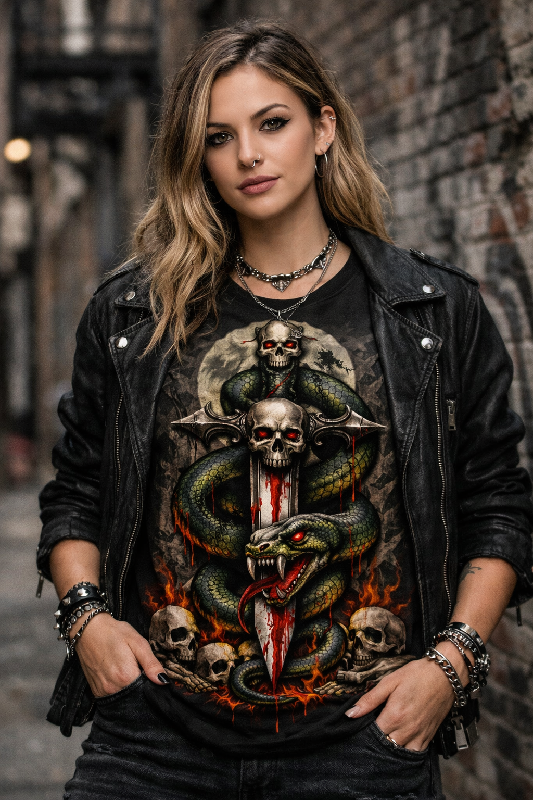
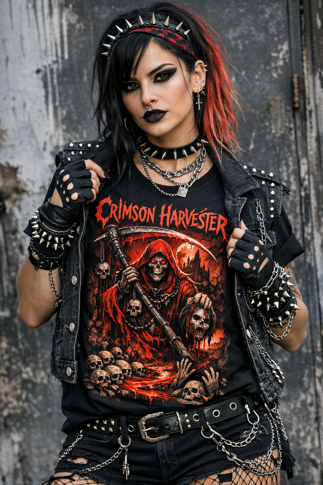
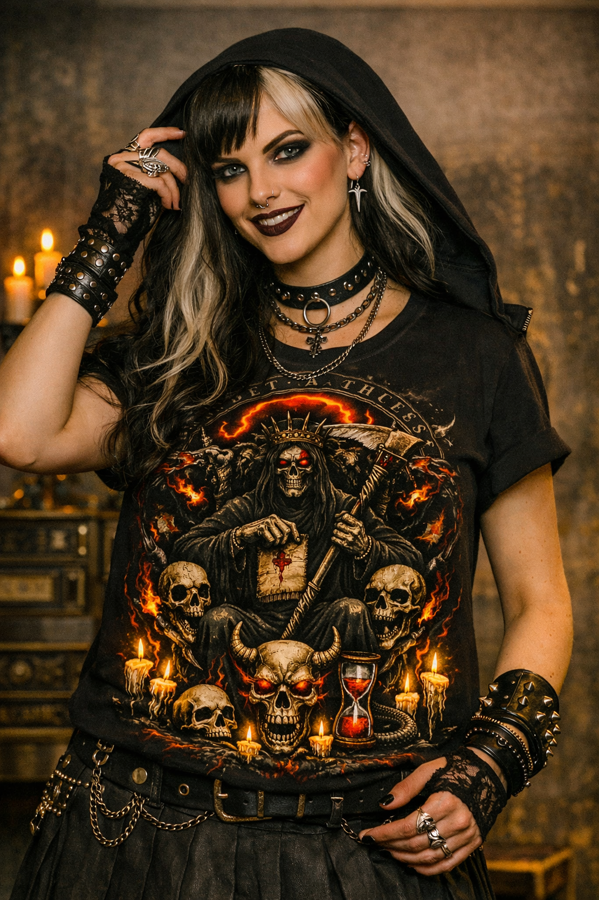
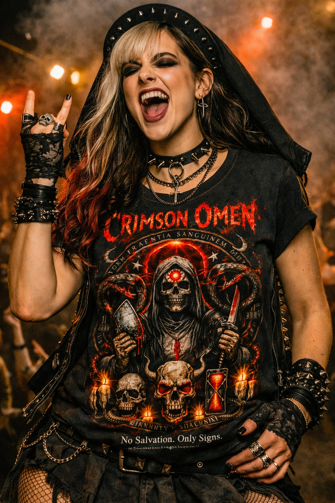
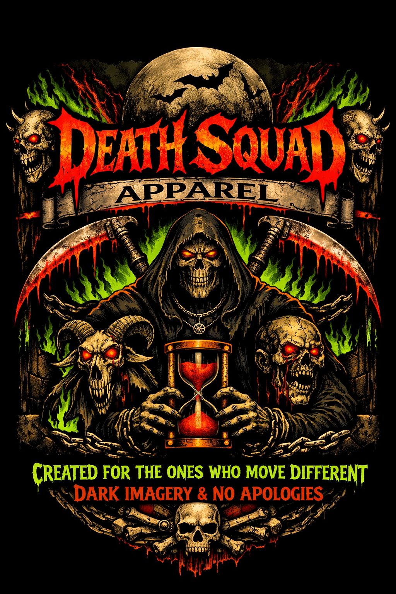

<html lang="en">
<head>
  <meta charset="UTF-8" />
  <title>Death Squad Apparel</title>
  <meta name="viewport" content="width=device-width, initial-scale=1" />
  
</head>
<body>
  

    <!-- HEADER -->
    <header>
      

        

          

            DEATH&nbsp;SQUAD
            APPAREL
          

        

        <nav class="nav-links">
          <a href="#new-drops">New Drops</a>
          <a href="#evil-ways">Evil Ways</a>
          <a href="#best-sellers">Best Sellers</a>
          <a href="#limited-bloodline">Limited Bloodline</a>
        </nav>
        

          
🛒

        

      

    </header>

    <!-- HERO -->
    <main>
      <section class="hero">
        

          

            

              
DEATH&nbsp;SQUAD

              
APPAREL

            

            <h1 class="hero-title">Wear Your Darkness.</h1>
            

              Premium streetwear forged in shadow. Limited drops only. Built for the ones who walk the edge.
            

            

              <button class="btn btn-primary">Shop New Drops</button>
              <button class="btn btn-ghost">Evil Ways Collection</button>
            

            

             
            

          

          

            

              

                
                
                
              

              

                
              

              

                
              

              

                
              

            

          

        

      </section>

      <!-- EVIL WAYS SECTION -->
      <section id="evil-ways">
        

          

            
            <h2 class="section-title">Evil Ways: The Signature Line</h2>
            

              Icons of the macabre. Built for the wicked. Each piece feels like a symbol, not just a shirt.
            

          

          

            <article class="product-card">
              
Crimson Harvester

              
            </article>
            <article class="product-card">
              
Infernal Relic

              
            </article>
            <article class="product-card">
              
Silent Witness

              
            </article>
            <article class="product-card">
              
Venom Oath

              
            </article>
          

      

     
        

          

            
            <h2 class="section-title">Marked by the Squad</h2>
            

              The pieces that never stay in stock for long. Once they’re gone, they’re gone.
            

          

          

            <article class="product-card">
              
Limited Run!

              
              

              

            </article>
            <article class="product-card">
              
              
Limited Run!

              
              

                
              

            </article>
            <article class="product-card">
              
              
Limited Run!

              
              

                
              

            </article>
          

        

      

      <!-- LIMITED BLOODLINE + EMAIL -->
      <section id="limited-bloodline">
        

          

           
            <h2 class="section-title">Numbered Releases Only</h2>
            

              Short-run drops for collectors of the dark. Each piece is tagged, tracked, and never reprinted.
            

          

          

            

              <h3 class="cta-title">Join the Death Squad</h3>
              

                Get early access to drops & exclusive releases. No spam. Just darkness.
              

              <form class="cta-form">
                <input
                  type="email"
                  class="cta-input"
                  placeholder="Enter your email"
                  required
                />
                <button type="submit" class="cta-button">Join Now</button>
              </form>
            

          

        

      </section>
    

    <!-- FOOTER -->
    <footer>
      

        ©  Death Squad Apparel. All rights reserved.
      

    </footer>
  

  
<article class="product-card">

</article>
